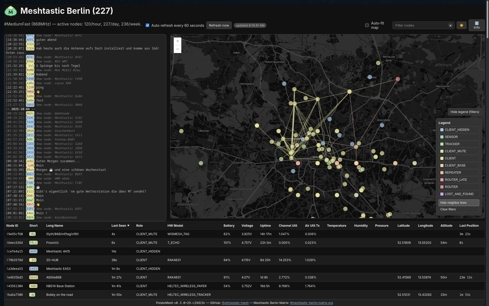

# 🥔 PotatoMesh

[](https://github.com/l5yth/potato-mesh/actions)
[](https://github.com/l5yth/potato-mesh/releases)
[](https://codecov.io/gh/l5yth/potato-mesh)
[](LICENSE)
[](https://github.com/l5yth/potato-mesh/issues)
[](https://matrix.to/#/#potatomesh:dod.ngo)

A simple Meshtastic-powered node dashboard for your local community. _No MQTT clutter, just local LoRa aether._

* Web app with chat window and map view showing nodes, neighbors, telemetry, and messages.
* API to POST (authenticated) and to GET nodes and messages.
* Supplemental Python ingestor to feed the POST APIs of the Web app with data remotely.
* Shows new node notifications (first seen) in chat.
* Allows searching and filtering for nodes in map and table view.

Live demo for Berlin #MediumFast: [potatomesh.net](https://potatomesh.net)



## Web App

Requires Ruby for the Sinatra web app and SQLite3 for the app's database.

```bash
pacman -S ruby sqlite3
gem install sinatra sqlite3 rackup puma rspec rack-test rufo prometheus-client
cd ./web
bundle install
```

### Run

Check out the `app.sh` run script in `./web` directory.

```bash
API_TOKEN="1eb140fd-cab4-40be-b862-41c607762246" ./app.sh
== Sinatra (v4.1.1) has taken the stage on 41447 for development with backup from Puma
Puma starting in single mode...
[...]
*  Environment: development
*          PID: 188487
* Listening on http://127.0.0.1:41447
```

Check [127.0.0.1:41447](http://127.0.0.1:41447/) for the development preview
of the node map. Set `API_TOKEN` required for authorizations on the API's POST endpoints.

### Production

When promoting the app to production, run the server with the minimum required
configuration to ensure secure access and proper routing:

```bash
RACK_ENV="production" \
APP_ENV="production" \
API_TOKEN="SuperSecureTokenReally" \
INSTANCE_DOMAIN="https://potatomesh.net" \
exec ruby app.rb -p 41447 -o 0.0.0.0
```

* `RACK_ENV` and `APP_ENV` must be set to `production` to enable optimized
  settings suited for live deployments.
* Bind the server to a production port and all interfaces (`-p 41447 -o 0.0.0.0`)
  so that clients can reach the dashboard over the network.
* Provide a strong `API_TOKEN` value to authorize POST requests against the API.
* Configure `INSTANCE_DOMAIN` with the public URL of your deployment so vanity
  links and generated metadata resolve correctly.

The web app can be configured with environment variables (defaults shown):

* `SITE_NAME` - title and header shown in the UI (default: "PotatoMesh Demo")
* `CHANNEL` - default channel shown in the UI (default: "#LongFast")
* `FREQUENCY` - default frequency shown in the UI (default: "915MHz")
* `MAP_CENTER` - default map center coordinates (default: `38.761944,-27.090833`)
* `MAX_DISTANCE` - hide nodes farther than this distance from the center (default: `42`)
* `CONTACT_LINK` - chat link or Matrix alias for footer and overlay (default: `#potatomesh:dod.ngo`)
* `PRIVATE` - set to `1` to hide the chat UI, disable message APIs, and exclude hidden clients (default: unset)
* `INSTANCE_DOMAIN` - public hostname (optionally with port) used for metadata, federation, and API links (default: auto-detected)
* `FEDERATION` - set to `1` to announce your instance and crawl peers, or `0` to disable federation (default: `1`)

The application derives SEO-friendly document titles, descriptions, and social
preview tags from these existing configuration values and reuses the bundled
logo for Open Graph and Twitter cards.

Example:

```bash
SITE_NAME="PotatoMesh Demo" MAP_CENTER=38.761944,-27.090833 MAX_DISTANCE=42 CONTACT_LINK="#potatomesh:dod.ngo" ./app.sh
```

### Configuration & Storage

PotatoMesh stores its runtime assets using the XDG base directory specification.
When XDG directories are not provided the application falls back
to the repository root.

The key is written to `$XDG_CONFIG_HOME/potato-mesh/keyfile` and the
well-known document is staged in
`$XDG_CONFIG_HOME/potato-mesh/well-known/potato-mesh`.

The database can be found in `$XDG_DATA_HOME/potato-mesh`.

### Federation

PotatoMesh instances can optionally federate by publishing signed metadata and
discovering peers. Federation is enabled by default and controlled with the
`FEDERATION` environment variable. Set `FEDERATION=1` (default) to announce your
instance, respond to remote crawlers, and crawl the wider network. Set
`FEDERATION=0` to keep your deployment isolated—federation requests will be
ignored and the ingestor will skip discovery tasks. Private mode still takes
precedence; when `PRIVATE=1`, federation features remain disabled regardless of
the `FEDERATION` value.

When federation is enabled, PotatoMesh automatically refreshes entries from
known peers every eight hours to keep the directory current. Instances that
stop responding are considered stale and are removed from the web frontend after
72 hours, ensuring visitors only see active deployments in the public
directory.

### API

The web app contains an API:

* GET `/api/nodes?limit=100` - returns the latest 100 nodes reported to the app
* GET `/api/positions?limit=100` - returns the latest 100 position data
* GET `/api/messages?limit=100` - returns the latest 100 messages (disabled when `PRIVATE=1`)
* GET `/api/telemetry?limit=100` - returns the latest 100 telemetry data
* GET `/api/neighbors?limit=100` - returns the latest 100 neighbor tuples
* GET `/api/instances` - returns known potato-mesh instances in other locations
* GET `/metrics`- metrics for the prometheus endpoint
* GET `/version`- information about the potato-mesh instance
* POST `/api/nodes` - upserts nodes provided as JSON object mapping node ids to node data (requires `Authorization: Bearer <API_TOKEN>`)
* POST `/api/positions` - appends positions provided as a JSON object or array (requires `Authorization: Bearer <API_TOKEN>`)
* POST `/api/messages` - appends messages provided as a JSON object or array (requires `Authorization: Bearer <API_TOKEN>`; disabled when `PRIVATE=1`)
* POST `/api/telemetry` - appends telemetry provided as a JSON object or array (requires `Authorization: Bearer <API_TOKEN>`)
* POST `/api/neighbors` - appends neighbor tuples provided as a JSON object or array (requires `Authorization: Bearer <API_TOKEN>`)

The `API_TOKEN` environment variable must be set to a non-empty value and match the token supplied in the `Authorization` header for `POST` requests.

### Observability

PotatoMesh ships with a Prometheus exporter mounted at `/metrics`. Consult
[`PROMETHEUS.md`](./PROMETHEUS.md) for deployment guidance, metric details, and
scrape configuration examples.

## Python Ingestor

The web app is not meant to be run locally connected to a Meshtastic node but rather
on a remote host without access to a physical Meshtastic device. Therefore, it only
accepts data through the API POST endpoints. Benefit is, here multiple nodes across the
community can feed the dashboard with data. The web app handles messages and nodes
by ID and there will be no duplication.

For convenience, the directory `./data` contains a Python ingestor. It connects to a
Meshtastic node via serial port or to a remote device that exposes the Meshtastic TCP
or Bluetooth (BLE) interfaces to gather nodes and messages seen by the node.

```bash
pacman -S python
cd ./data
python -m venv .venv
source .venv/bin/activate
pip install -U meshtastic
```

It uses the Meshtastic Python library to ingest mesh data and post nodes and messages
to the configured potato-mesh instance.

Check out `mesh.sh` ingestor script in the `./data` directory.

```bash
POTATOMESH_INSTANCE=http://127.0.0.1:41447 API_TOKEN=1eb140fd-cab4-40be-b862-41c607762246 CONNECTION=/dev/ttyACM0 DEBUG=1 ./mesh.sh
[2025-02-20T12:34:56.789012Z] [potato-mesh] [info] channel=0 context=daemon.main port='41447' target='http://127.0.0.1' Mesh daemon starting
[...]
[2025-02-20T12:34:57.012345Z] [potato-mesh] [debug] context=handlers.upsert_node node_id=!849b7154 short_name='7154' long_name='7154' Queued node upsert payload
[2025-02-20T12:34:57.456789Z] [potato-mesh] [debug] context=handlers.upsert_node node_id=!ba653ae8 short_name='3ae8' long_name='3ae8' Queued node upsert payload
[2025-02-20T12:34:58.001122Z] [potato-mesh] [debug] context=handlers.store_packet_dict channel=0 from_id='!9ee71c38' payload='Guten Morgen!' to_id='^all' Queued message payload
```

Run the script with `POTATOMESH_INSTANCE` and `API_TOKEN` to keep updating
node records and parsing new incoming messages. Enable debug output with `DEBUG=1`,
specify the connection target with `CONNECTION` (default `/dev/ttyACM0`) or set it to
an IP address (for example `192.168.1.20:4403`) to use the Meshtastic TCP
interface. `CONNECTION` also accepts Bluetooth device addresses (e.g.,
`ED:4D:9E:95:CF:60`) and the script attempts a BLE connection if available.

## Demos

Post your nodes here:

* <https://github.com/l5yth/potato-mesh/discussions/258>

## Docker

Docker images are published on Github for each release:

```bash
docker pull ghcr.io/l5yth/potato-mesh/web:latest
docker pull ghcr.io/l5yth/potato-mesh/ingestor:latest
```

See the [Docker guide](DOCKER.md) for more details and custome deployment instructions.

## License

Apache v2.0, Contact <COM0@l5y.tech>

Join our community chat to discuss the dashboard or ask for technical support:
[#potatomesh:dod.ngo](https://matrix.to/#/#potatomesh:dod.ngo)
