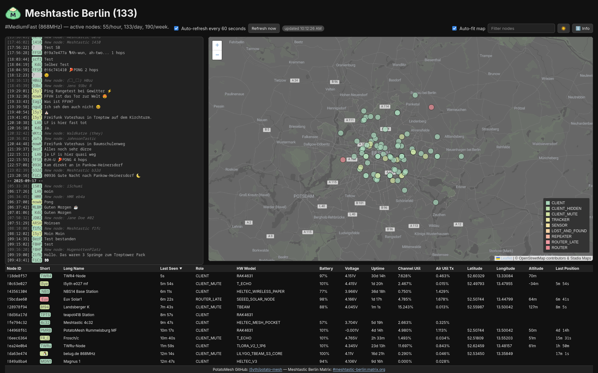

# Potato-Mesh

A simple Meshtastic-powered node dashboard for your local community. _No MQTT clutter, just local LoRa aether._

* Web app with chat window and map view showing nodes and messages.
* API to POST (authenticated) and to GET nodes and messages.
* Supplemental Python ingestor to feed the POST APIs of the Web app with data remotely.
* Shows new node notifications (first seen) in chat.
* Allows searching and filtering for nodes in map and table view.

Live demo for Berlin #MediumFast: [potatomesh.net](https://potatomesh.net)



## Web App

Requires Ruby for the Sinatra web app and SQLite3 for the app's database.

```bash
pacman -S ruby sqlite3
gem install sinatra sqlite3 rackup puma rspec rack-test rufo
cd ./web
bundle install
```

### Run

Check out the `app.sh` run script in `./web` directory.

```bash
API_TOKEN="1eb140fd-cab4-40be-b862-41c607762246" ./app.sh
== Sinatra (v4.1.1) has taken the stage on 41447 for development with backup from Puma
Puma starting in single mode...
[...]
*  Environment: development
*          PID: 188487
* Listening on http://127.0.0.1:41447
```

Check [127.0.0.1:41447](http://127.0.0.1:41447/) for the development preview
of the node map. Set `API_TOKEN` required for authorizations on the API's POST endpoints.

The web app can be configured with environment variables (defaults shown):

* `SITE_NAME` - title and header shown in the ui (default: "Meshtastic Berlin")
* `DEFAULT_CHANNEL` - default channel shown in the ui (default: "#MediumFast")
* `DEFAULT_FREQUENCY` - default channel shown in the ui (default: "868MHz")
* `MAP_CENTER_LAT` / `MAP_CENTER_LON` - default map center coordinates (default: `52.502889` / `13.404194`)
* `MAX_NODE_DISTANCE_KM` - hide nodes farther than this distance from the center (default: `137`)
* `MATRIX_ROOM` - matrix room id for a footer link (default: `#meshtastic-berlin:matrix.org`)

Example:

```bash
SITE_NAME="Meshtastic Berlin" MAP_CENTER_LAT=52.502889 MAP_CENTER_LON=13.404194 MAX_NODE_DISTANCE_KM=137 MATRIX_ROOM="#meshtastic-berlin:matrix.org" ./app.sh
```

### API

The web app contains an API:

* GET `/api/nodes?limit=100` - returns the latest 100 nodes reported to the app
* GET `/api/messages?limit=100` - returns the latest 100 messages
* POST `/api/nodes` - upserts nodes provided as JSON object mapping node ids to node data (requires `Authorization: Bearer <API_TOKEN>`)
* POST `/api/messages` - appends messages provided as a JSON object or array (requires `Authorization: Bearer <API_TOKEN>`)

The `API_TOKEN` environment variable must be set to a non-empty value and match the token supplied in the `Authorization` header for `POST` requests.

## Python Ingestor

The web app is not meant to be run locally connected to a Meshtastic node but rather
on a remote host without access to a physical Meshtastic device. Therefore, it only
accepts data through the API POST endpoints. Benefit is, here multiple nodes across the
community can feed the dashboard with data. The web app handles messages and nodes
by ID and there will be no duplication.

For convenience, the directory `./data` contains a Python ingestor. It connects to a local
Meshtastic node via serial port to gather nodes and messages seen by the node.

```bash
pacman -S python
cd ./data
python -m venv .venv
source .venv/bin/activate
pip install -U meshtastic
```

It uses the Meshtastic Python library to ingest mesh data and post nodes and messages
to the configured potato-mesh instance.

Check out `mesh.sh` ingestor script in the `./data` directory.

```bash
POTATOMESH_INSTANCE=http://127.0.0.1:41447 API_TOKEN=1eb140fd-cab4-40be-b862-41c607762246 MESH_SERIAL=/dev/ttyACM0 DEBUG=1 ./mesh.sh
Mesh daemon: nodes+messages → http://127.0.0.1 | port=41447 | channel=0
[...]
[debug] upserted node !849b7154 shortName='7154'
[debug] upserted node !ba653ae8 shortName='3ae8'
[debug] upserted node !16ced364 shortName='Pat'
[debug] stored message from '!9ee71c38' to '^all' ch=0 text='Guten Morgen!'
```

Run the script with `POTATOMESH_INSTANCE` and `API_TOKEN` to keep updating
node records and parsing new incoming messages. Enable debug output with `DEBUG=1`,
specify the serial port with `MESH_SERIAL` (default `/dev/ttyACM0`), etc.

## License

Apache v2.0, Contact <COM0@l5y.tech>
