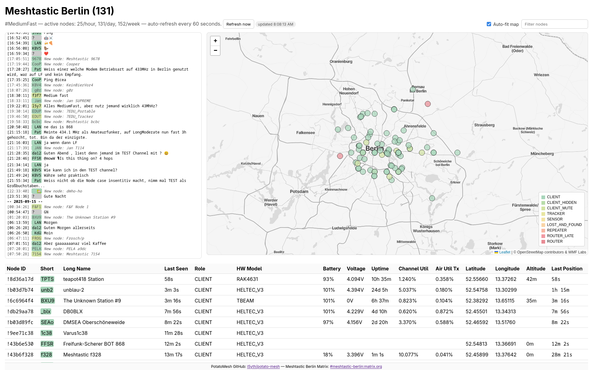

# potato-mesh

a simple meshtastic node dashboard for your local community. _no mqtt clutter, just local lora aether._

demo for berlin mediumfast: [potatomesh.net](https://potatomesh.net)



## status

_in active development._

what works:

* updating nodes from a locally connected meshtastic device (via serial)
* awaiting messages on default channel (0) from a local meshtastic device
* storing nodes and messages in a local database (sqlite3)
* displaying nodes ordered by last seen in a web app table view
* displaying nodes by geographic coordinates on a map layer, coloured by device role
* displaying new node notifications and chat messages in default channel in chat box
* displaying active node count and filtering nodes by name
* exposing nodes and messages to api endpoints
* posting nodes and messages to the api endpoints with authentication
 
## requirements

requires a meshtastic node connected (via serial) to gather mesh data and the meshtastic cli.

requires the meshtastic python api for communicating with the device.

```bash
python -m venv .venv
source .venv/bin/activate
pip install -U meshtastic
```

requires latest ruby and ruby gems for the sinatra web app.

```bash
gem install bundler
bundle install
```

### ingest

uses the meshtastic python library to ingest mesh data and post nodes and messages
to the configured potatomesh instance.

run `mesh.sh` in `data/` with `POTATOMESH_INSTANCE` and `API_TOKEN` to keep updating
node records and parsing new incoming messages.

```bash
POTATOMESH_INSTANCE=https://potatomesh.net API_TOKEN=TOKEN MESH_SERIAL=/dev/ttyACM0 DEBUG=1 ./mesh.sh
[...]
[debug] upserted node !849b7154 shortName='7154'
[debug] upserted node !ba653ae8 shortName='3ae8'
[debug] upserted node !16ced364 shortName='Pat'
[debug] stored message from '!9ee71c38' to '^all' ch=0 text='Guten Morgen!'
```

enable debug output with `DEBUG=1`, specify the serial port with `MESH_SERIAL`
(default `/dev/ttyACM0`).

### web app

uses a ruby sinatra webapp to display data from the sqlite database

run `app.sh` in `web/` to run the sinatra webserver and check
[127.0.0.1:41447](http://127.0.0.1:41447/) for the correct node map.

```bash
API_TOKEN="1eb140fd-cab4-40be-b862-41c607762246" ./app.sh
== Sinatra (v4.1.1) has taken the stage on 41447 for development with backup from Puma
Puma starting in single mode...
[...]
*  Environment: development
*          PID: 188487
* Listening on http://127.0.0.1:41447
```

set `API_TOKEN` required for authorizations on the api post-endpoints.

the web app can be configured with environment variables (defaults shown):

* `SITE_NAME` - title and header shown in the ui (default: "Meshtastic Berlin")
* `DEFAULT_CHANNEL` - default channel shown in the ui (default: "#MediumFast")
* `MAP_CENTER_LAT` / `MAP_CENTER_LON` - default map center coordinates (default: `52.502889` / `13.404194`)
* `MAX_NODE_DISTANCE_KM` - hide nodes farther than this distance from the center (default: `137`)
* `MATRIX_ROOM` - matrix room id for a footer link (default: `#meshtastic-berlin:matrix.org`)

example:

```bash
SITE_NAME="Meshtastic Berlin" MAP_CENTER_LAT=52.502889 MAP_CENTER_LON=13.404194 MAX_NODE_DISTANCE_KM=137 MATRIX_ROOM="#meshtastic-berlin:matrix.org" ./app.sh
```

## api

the web app contains an api:

* GET `/api/nodes?limit=1000` - returns the latest 1000 nodes reported to the app
* GET `/api/messages?limit=1000` - returns the latest 1000 messages
* POST `/api/nodes` - upserts nodes provided as JSON object mapping node ids to node data (requires `Authorization: Bearer <API_TOKEN>`)
* POST `/api/messages` - appends messages provided as a JSON object or array (requires `Authorization: Bearer <API_TOKEN>`)

the `API_TOKEN` environment variable must be set to a non-empty value and match the token supplied in the `Authorization` header for `POST` requests.

## license

apache v2.0
