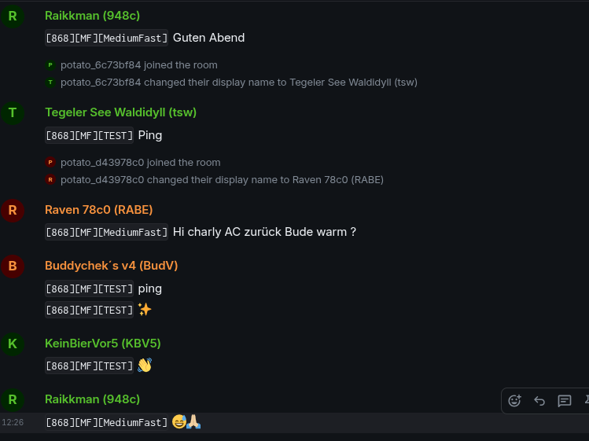

# potatomesh-matrix-bridge

A small Rust daemon that bridges **PotatoMesh** LoRa messages into a **Matrix** room.



For each PotatoMesh node, the bridge creates (or uses) a **Matrix puppet user**:

- Matrix localpart: `potato_` + the hex node id (without `!`), e.g. `!67fc83cb` → `@potato_67fc83cb:example.org`
- Matrix display name: the node’s `long_name` from the PotatoMesh API

Messages from PotatoMesh are periodically fetched and forwarded to a single Matrix room as those puppet users.

---

## Features

- Polls `https://potatomesh.net/api/messages` (deriving `/api` from the configured base domain)
- Looks up node metadata via `GET /api/nodes/{hex}` and caches it
- One Matrix user per node:
  - username: `potato_{hex node id}`
  - display name: `long_name`
- Forwards `TEXT_MESSAGE_APP` messages into a single Matrix room
- Persists last-seen message ID to avoid duplicates across restarts

---

## Architecture Overview

- **PotatoMesh side**
  - `GET /api/messages` returns an array of messages
  - `GET /api/nodes/{hex}` returns node metadata (including `long_name`)

- **Matrix side**
  - Uses the Matrix Client-Server API with an **appservice access token**
  - Impersonates puppet users via `user_id=@potato_{hex}:{server_name}&access_token={as_token}`
  - Sends `m.room.message` events into a configured room

This is **not** a full appservice framework; it just speaks the minimal HTTP needed.

---

## Requirements

- Rust (stable) and `cargo`
- A Matrix homeserver you control (e.g. Synapse)
- An **application service registration** on your homeserver that:
  - Whitelists the puppet user namespace (e.g. `@potato_[0-9a-f]{8}:example.org`)
  - Provides an `as_token` the bridge can use

- Network access from the bridge host to:
  - `https://potatomesh.net/` (bridge appends `/api`)
  - Your Matrix homeserver (`https://matrix.example.org`)

---

## Configuration

All configuration is in `Config.toml` in the project root.

Example:

```toml
[potatomesh]
# Base domain (bridge will call {base_url}/api)
base_url = "https://potatomesh.net/"
# Poll interval in seconds
poll_interval_secs = 10

[matrix]
# Homeserver base URL (client API) without trailing slash
homeserver = "https://matrix.example.org"
# Appservice access token (from your registration.yaml)
as_token = "YOUR_APPSERVICE_AS_TOKEN"
# Appservice homeserver token (must match registration hs_token)
hs_token = "SECRET_HS_TOKEN"
# Server name (domain) part of Matrix user IDs
server_name = "example.org"
# Room ID to send into (must be joined by the appservice / puppets)
room_id = "!yourroomid:example.org"

[state]
# Where to persist last seen message id
state_file = "bridge_state.json"
````

The `hs_token` is used to validate inbound appservice transactions. Keep it identical in `Config.toml` and your Matrix appservice registration file.

### PotatoMesh API

The bridge assumes:

* Messages: `GET {base_url}/api/messages` → JSON array, for example:

  ```json
  [
    {
      "id": 2947676906,
      "rx_time": 1764241436,
      "rx_iso": "2025-11-27T11:03:56Z",
      "from_id": "!da6556d4",
      "to_id": "^all",
      "channel": 1,
      "portnum": "TEXT_MESSAGE_APP",
      "text": "Ping",
      "rssi": -111,
      "hop_limit": 1,
      "lora_freq": 868,
      "modem_preset": "MediumFast",
      "channel_name": "TEST",
      "snr": -9.0,
      "node_id": "!06871773"
    }
  ]
  ```

* Nodes: `GET {base_url}/api/nodes/{hex}` → JSON, for example:

  ```json
  {
    "node_id": "!67fc83cb",
    "short_name": "83CB",
    "long_name": "Meshtastic 83CB",
    "role": "CLIENT_HIDDEN",
    "last_heard": 1764250515,
    "first_heard": 1758993817,
    "last_seen_iso": "2025-11-27T13:35:15Z"
  }
  ```

Node hex ID is derived from `node_id` by stripping the leading `!` and using the remainder inside the puppet localpart prefix (`potato_{hex}`).

---

## Matrix Appservice Setup (Synapse example)

You need an appservice registration file (e.g. `potatomesh-bridge.yaml`) configured in Synapse.

A minimal example sketch (you **must** adjust URLs, secrets, namespaces):

```yaml
id: potatomesh-bridge
url: "http://your-bridge-host:41448"
as_token: "YOUR_APPSERVICE_AS_TOKEN"
hs_token: "SECRET_HS_TOKEN"
sender_localpart: "potatomesh-bridge"
rate_limited: false
namespaces:
  users:
    - exclusive: true
      regex: "@potato_[0-9a-f]{8}:example.org"
```

This bridge listens for Synapse appservice callbacks on port `41448` so it can log inbound transaction payloads. It still only forwards messages one way (PotatoMesh → Matrix), so inbound Matrix events are acknowledged but not bridged. The `as_token` and `namespaces.users` entries remain required for outbound calls, and the `url` should point at the listener.

In Synapse’s `homeserver.yaml`, add the registration file under `app_service_config_files`, restart, and invite a puppet user to your target room (or use room ID directly).

The bridge validates inbound appservice callbacks by comparing the `access_token` query param to `hs_token` in `Config.toml`, so keep those values in sync.

---

## Build

```bash
# clone
git clone https://github.com/YOUR_USER/potatomesh-matrix-bridge.git
cd potatomesh-matrix-bridge

# build
cargo build --release
```

The resulting binary will be at:

```bash
target/release/potatomesh-matrix-bridge
```

---

## Docker

Build the container from the repo root with the included `matrix/Dockerfile`:

```bash
docker build -f matrix/Dockerfile -t potatomesh-matrix-bridge .
```

Provide your config at `/app/Config.toml` and persist the bridge state file by mounting volumes. Minimal example:

```bash
docker run --rm \
  -p 41448:41448 \
  -v bridge_state:/app \
  -v "$(pwd)/matrix/Config.toml:/app/Config.toml:ro" \
  potatomesh-matrix-bridge
```

If you prefer to isolate the state file from the config, mount it directly instead of the whole `/app` directory:

```bash
docker run --rm \
  -p 41448:41448 \
  -v bridge_state:/app \
  -v "$(pwd)/matrix/Config.toml:/app/Config.toml:ro" \
  potatomesh-matrix-bridge
```

The image ships `Config.example.toml` for reference, but the bridge will exit if `/app/Config.toml` is not provided.

---

## Run

Ensure `Config.toml` is present and valid, then:

```bash
./target/release/potatomesh-matrix-bridge
```

Environment variables you may care about:

* `RUST_LOG` – for logging, e.g.:

  ```bash
  RUST_LOG=info,reqwest=warn ./target/release/potatomesh-matrix-bridge
  ```

The bridge will:

1. Load state from `bridge_state.json` (if present).
2. Poll PotatoMesh every `poll_interval_secs`.
3. For each new `TEXT_MESSAGE_APP`:

   * Fetch node info.
   * Ensure puppet is registered (`@potato_{hex}:{server_name}`).
   * Set puppet display name to `long_name`.
   * Send a formatted text message into `room_id` as that puppet.
   * Update and persist `bridge_state.json`.

Delete `bridge_state.json` if you want it to replay all currently available messages.

---

## Development

Run tests (currently mostly compile checks, no real tests yet):

```bash
cargo test
```

Format code:

```bash
cargo fmt
```

Lint (optional but recommended):

```bash
cargo clippy -- -D warnings
```

---

## GitHub Actions CI

This repository includes a GitHub Actions workflow (`.github/workflows/ci.yml`) that:

* runs on pushes and pull requests
* caches Cargo dependencies
* runs:

  * `cargo fmt --check`
  * `cargo clippy`
  * `cargo test`

See the workflow file for details.

---

## Caveats & Future Work

* No E2EE: this bridge posts into unencrypted (or server-side managed) rooms. For encrypted rooms, you’d need real E2EE support and key management.
* No inbound Matrix → PotatoMesh direction yet. This is a one-way bridge (PotatoMesh → Matrix).
* No pagination or `since` support on the PotatoMesh API. The bridge simply deduplicates by message `id` and stores the highest seen.

If you change the PotatoMesh API, adjust the types in `src/potatomesh.rs` accordingly.
